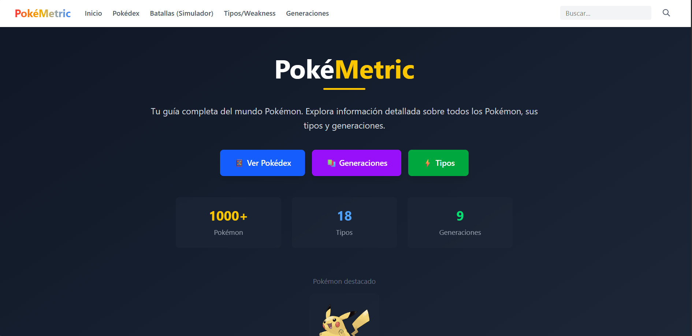
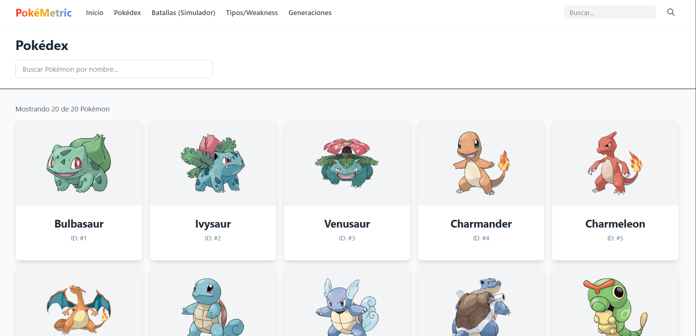
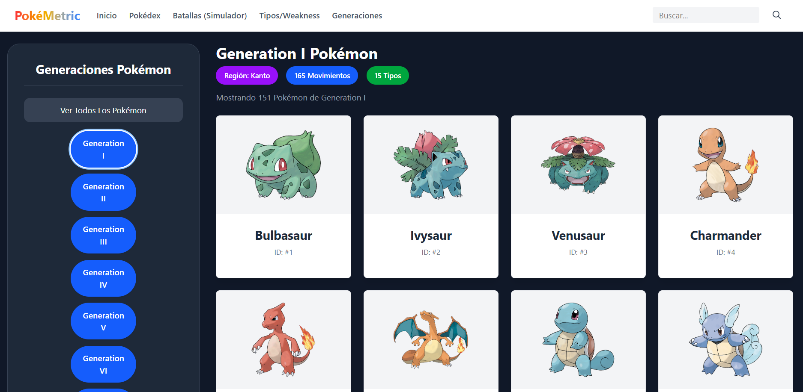
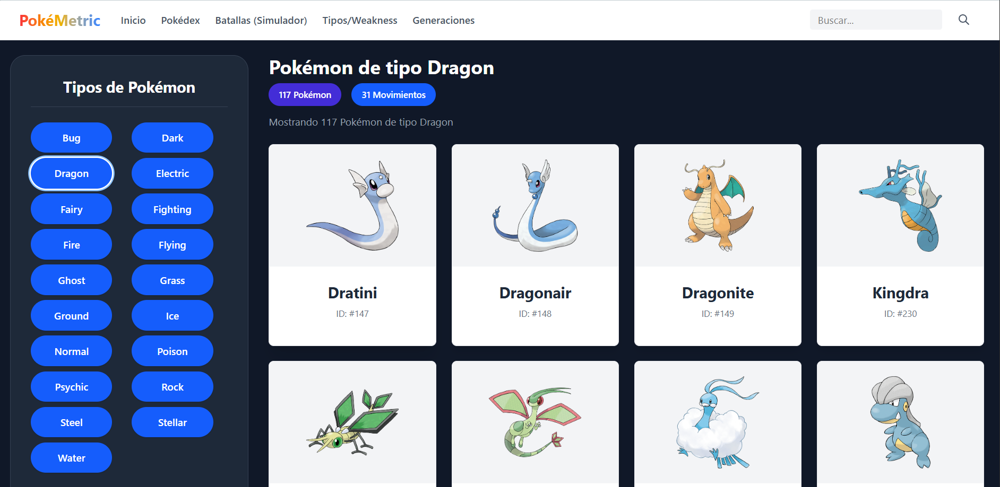
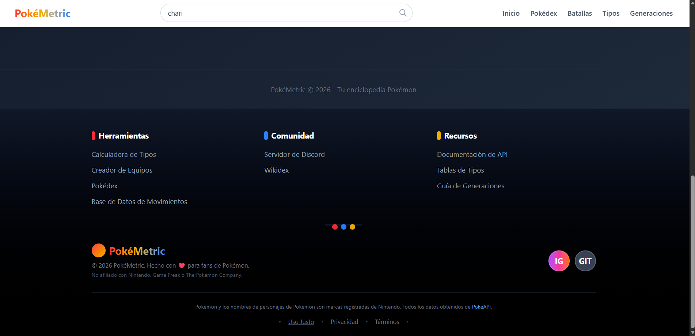

# PokeGuía

PokeGuía es una aplicación web intuitiva y moderna, desarrollada con React y Vite, que proporciona un compendio íntegro sobre el universo Pokémon. Más que una enciclopedia, incluye herramientas avanzadas para visualizar datos, movimientos, tipos y ayudar en la creación de equipos.

## 🌟 Características Principales

- **Inicio**: Página principal atractiva con la introducción y navegación central de la aplicación.
- **Pokédex Interactiva**: Consulta de forma interactiva información vital de cada Pokémon.
- **Generaciones**: Explora y clasifica todos los Pokémon en base a su respectiva generación.
- **Base de Datos de Movimientos**: Descubre el poder, clase, precisión y efectos de los ataques Pokémon.
- **Calculadora de Tipos**: Conoce rápidamente debilidades, resistencias, e inmunidades para planear tus estrategias.
- **Creador de Equipo Pokémon**: Ensambla y visualiza a tu equipo Pokémon de ensueño.
- **Sistema de Filtros**: Búsqueda potente en varias secciones de la página (Movimientos, Equipos, Pokédex).

## 🛠️ Tecnologías y Herramientas

- **React**: Biblioteca principal para la construcción de interfaces.
- **Vite**: Entorno de desarrollo para un *build* rápido.
- **React Router DOM**: Manejo dinámico de las rutas en el lado del cliente.
- **TailwindCSS**: Diseño elegante y responsivo gracias a las clases de utilidad.
- **ESLint**: Linter configurado para mantener un estándar de limpieza en el código.

## 📁 Estructura Principal

```plaintext
src/
├── App.jsx
├── index.css
├── main.jsx
├── assets/         # Carpeta con capturas e imágenes para diseño
├── components/     # Componentes modulares (Navbar, Sidebar, Footer, etc.)
├── pages/          # Las diferentes vistas principales de PokeGuía
└── utils/          # Configuración y llamadas a consumo de APIs
```

## 🚀 Cómo ejecutar el proyecto

Clona el repositorio e instala las dependencias, luego ejecuta los siguientes scripts:

- `npm install`: Instalación de paquetes requeridos.
- `npm run dev`: Levanta el entorno de desarrollo local.
- `npm run build`: Construye la aplicación para despliegue en producción.

## 📷 Capturas de Pantalla y Vistas

### Páginas Principales






### Herramientas Avanzadas


### Sistema de Filtros Personalizados


 
